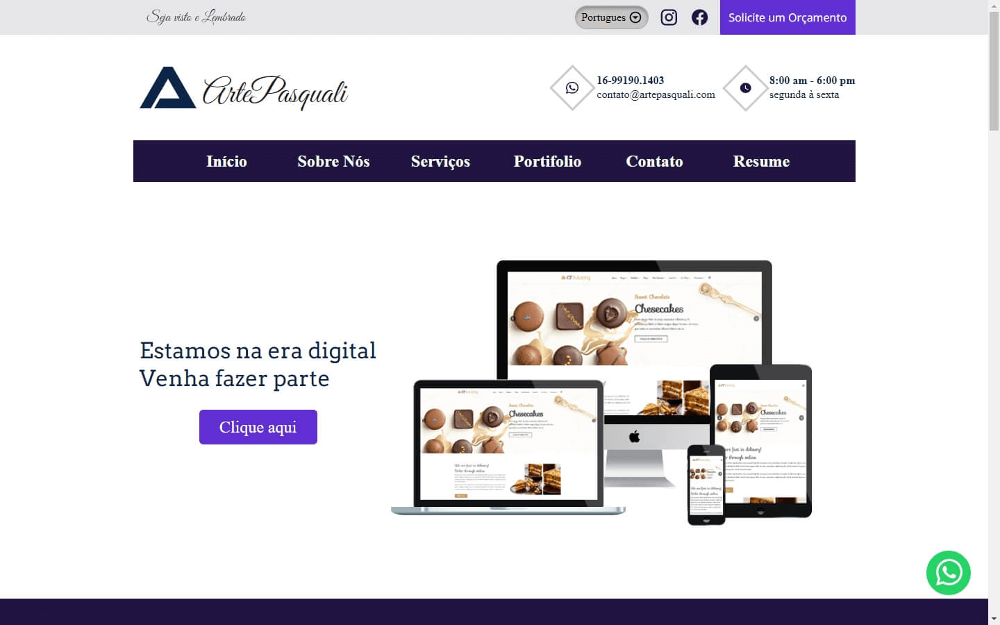

# Multilanguage README Choose your language

 

<h1 align="center">
  💻 Portfolio - Pasquali (Under Construction)
</h1>

<h4 align="center"><a href="https://www.artepasquali.com">Click to visit the project</a></h4>

## 📚 Sections

The website consists of six sections:

-   **Inicio:** Here, we have a brief introduction;
-   **Sobre Nós:** In this section, I have a description that tells a bit about who we are;
-   **Serviços:** It displays different services I have knowledge of through cards;
-   **Portifolio:** It showcases different projects developed, with direct links to their GitHub repositories;
-   **Contato:** Information how to contact me and WhatsApp for getting in touch;
-   **Resume:** Here, I present my resume containing my skills, with links to the obtained certificates;

---

## 💼 Technologies Used

For the development of this website, I used the following technologies:

-   HTML;
-   Sass;
-   JavaScript;
-   React;

---

<h2>🦄 Author</h2>

<table>
  <tr>
    <td align="center">
      <a href="https://github.com/PasqualiRafael">
         
        
          <b>Pasquali</b>
        
      </a>
    </td>
  </tr>
</table>
